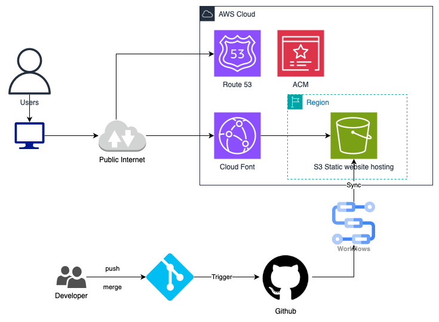

## My_blog
This is my blog! There are many things about me! Enjoy it!!

https://mcong9x64-portfolio.tutorial-aws.click

## Architecture Overview

The provided architecture diagram outlines a static website hosting solution using AWS services integrated with GitHub for CI/CD automation:

### Components:

* **AWS Cloud**: Hosts and serves the static website.

  * **Route 53**: Manages DNS and domain name routing.
  * **AWS Certificate Manager (ACM)**: Provides SSL/TLS certificates for secure HTTPS connections.
  * **CloudFront**: Acts as a Content Delivery Network (CDN), distributing website content globally with low latency.
  * **S3 Bucket (Static Website Hosting)**: Stores static website files and serves them.

* **GitHub**:

  * Developers push and merge code into GitHub, triggering automated workflows.
  * **GitHub Actions (Workflows)**: Automate synchronization of website content to the AWS S3 bucket.

### Workflow:

1. **Developer** commits and merges code changes into GitHub.
2. **GitHub Actions** triggers automatically, syncing the updated static files to the S3 bucket.
3. **S3 Bucket** hosts the static website.
4. Users access the website via the **Public Internet**, leveraging **Route 53** for domain resolution, **CloudFront** for efficient content delivery, and secure connections provided by **ACM**.
